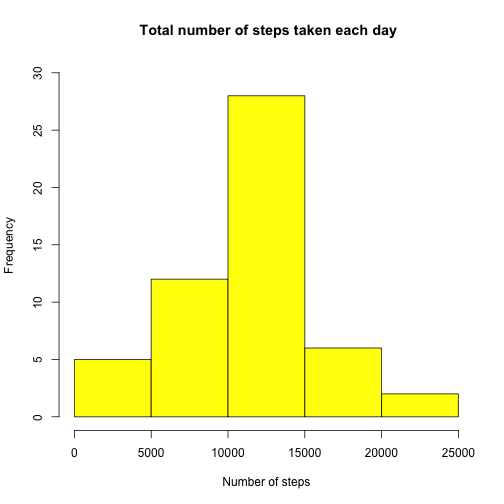
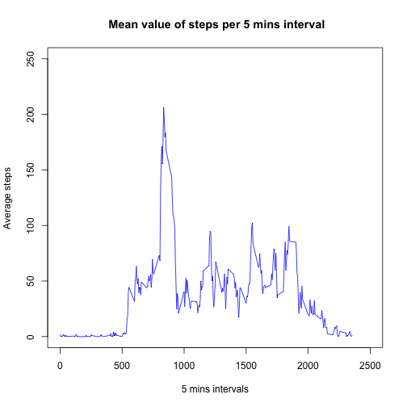
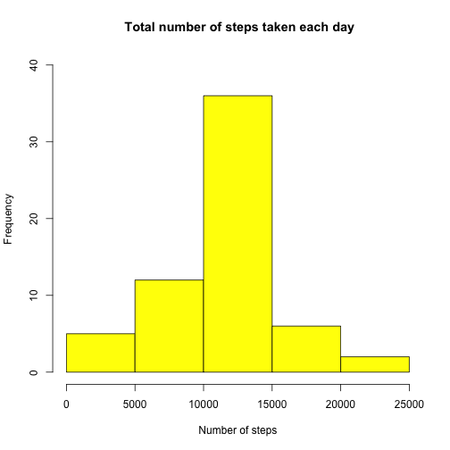
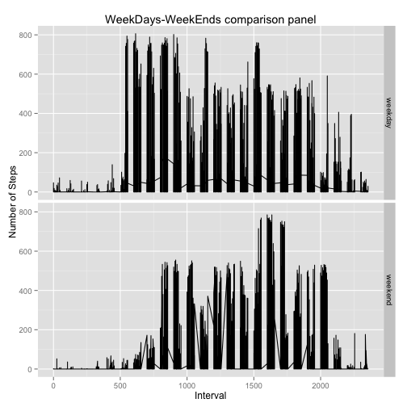

### Loading and preprocessing the data


```r
    # Position root directory for analysis (hardwired)
    workdir <- "/Users/fbreschi/Documents/GitHubRepos/RepData_PeerAssessment1"
    setwd(workdir)    
    # (1) Read data (raw data)
    rdata <- read.csv("activity.csv")    
    # (2) Clean data
    cdata <- rdata[complete.cases(rdata),]
```


### What is mean total number of steps taken per day?

#### (1) Make a histogram of the total number of steps taken each day

 

#### (2) Calculate and report the mean and median total number of steps taken per day


```
## Mean of daily steps is:  10766.19
```

```
## Median of daily steps is:  10765
```

### What is the average daily activity pattern?
#### (1) Make a time series plot (i.e. type = "l") of the 5-minute interval (x-axis) and the average number of steps taken, averaged across all days (y-axis)

 

#### (2) Which 5-minute interval, on average across all the days in the dataset, contains the maximum number of steps?


```
## Interval:  835
```

```
## Max no. of mean steps per interval:  206.17
```

### Imputing missing values

#### (1) Calculate and report the total number of missing values in the dataset (i.e. the total number of rows with ```NAs```)

```
## Total number of rows with NAs:  2304
```

#### (2) Devise a strategy for filling in all of the missing values in the dataset. The strategy does not need to be sophisticated. For example, you could use the mean/median for that day, or the mean for that 5-minute interval, etc.
*Note: The strategy of filling up ```NAs``` with ```mean()``` for that particular day is not applicable since ```2012-10-01``` is not present in ```complete cases``` cleaned dataset, so we do have to use the other strategy: to replace the ```NAs``` with the ```mean()``` for that particular 5 mins interval*

#### (3) Create a new dataset that is equal to the original dataset but with the missing data filled in.


```r
    # Create a new stage data frame to hold mean values for every single day from raw data accordingly with strategy
    sdata <- rdata

    # Scan and fill up the stage data frame with mean values for each 5 min interval (we do already have that info)
    for (i in  1:nrow(sdata)){ 
        if (is.na(sdata[i,]$steps)){
            sdata[i,]$steps=dfi[dfi$interval==(sdata[i,]$interval),]$msteps
        }
    }
```

#### (4) Make a histogram of the total number of steps taken each day

 

#### (5) Report the mean and median total number of steps taken per day


```
## Mean total steps per day:  10766.19
```

```
## Median of total steps per day:  10766.19
```

#### (6) Do these values differ from the estimates from the first part of the assignment? 

*Yes.*

#### (7) What is the impact of imputing missing data on the estimates of the total daily number of steps?

*The main impact is about influencing the total number of steps (see histograms). As we are introducing mean values on the time intervals as fillers, the qualitative behaviour of the Histogram is not impacted. Noticeable is the fact that the ```median()``` corresponds to the ```mean()```, because of the correspondence of a ```NA``` substituted value positionally as the ```median()``` algorithm demands for an ordered list of values.*

### Are there differences in activity patterns between weekdays and weekends?

#### (1) Create a new factor variable in the dataset with two levels -- "weekday" and "weekend" indicating whether a given date is a weekday or weekend day.


```
## New column variable name {dc} is of class:  factor
```

```
## weekday weekend
```

#### (2) Make a panel plot containing a time series plot (i.e. type = "l") of the 5-minute interval (x-axis) and the average number of steps taken, averaged across all weekday days or weekend days (y-axis).

 

